## Sentiment Analysis of Airline News Sources

I work as a developer for a major airline which is currently going through a technology transformation. As part of this transformation, one question that was recently posed was, "How does our technology stack compare to other airlines?" After some discussion it was decided that there was no real way to know. However, in this conversation it was thought that certain airlines had a reputation for being more technologically advanced and reporting more on technology. This got me thinking about how different airlines are reported on and how this reporting impacts public opinion.<br>
<br>
To try and answer these questions text and sentiment analysis was performed on a couple of popular travel websites that do reporting on major airlines. The goal was to use the written article and any available comments to try and find patterns or differences on how different airlines were reported on, and if this reporting had any impact on public opinion or sentiment.


## Data

The text data for this project was scrpaed from two popular travel websites [The Points Guy](https://thepointsguy.com/) and [One Mile At A Time](https://onemileatatime.com/), with the focus being on three main airlines: American Airlines, Delta, and United. This project was limited to articles dating between January 1st, 2019 and January 31st, 2021. The data chosen to be scraped from each article, if available, was:<br>

- Date the article was published
- The author of the article
- Title of the article
- The tags of the article
- The article content or the writing of the article
- Any comments on the article if they are available
- The name of the site the data was scraped from

## Data Collection and Cleaning

The first step of data collection was to create a list of URL's from the two websites that were within the date range and written about one of the three chosen airlines. This was done manually since it only needed to be done once and automating it would have probably taken more time. The URL's were compiled into two csv's, one for each website. There were 744 article URL's from One Mile At A Time, and 691 from the The Points Guy that fit the criteria, totaling a little under 1500 articles.
<br>
<br>
Python was then used to write webscraping code for each of the two websites. This code took as input the list of URL's then iterated through the list scraping the data mentioned in the above section from each article. This scraped data from each site was then written to a common csv. During the scraping process, punctuation and some whitespace characters were removed from the article content and comments to help with analysis. Once the scraping was completed and the data was compiled into a singular file it was passed into R for further cleaning.
<br>
<br>
One of the bigger challenges was unifying the dates between the two websites as they each used different date formats. To create a single date format all of the dates were first converted to strings. The `str_replace()` function from the *stringr* library was used to replace shortened month names with the full month name (i.e. "jan" to "january"). Once this was completed and after some research into different date formats the date string were converted into date objects using the `as.Date()` method with the format `"%B %d %Y"`. This format corresponds to the full month name, followed by the day of the month, followed by the four digit year (i.e. "january 1 2021"). This conversion and unification allowed for any time based analysis to be done when analyzing the data.
<br>
<br>
The article tags was another area where some data clean up was needed. When splitting the data by different airlines the article tags were used decide what airline the article was written about. When first splitting I noticed that American Airlines had much fewer data points than either Delta or United. After looking at different subsets of tags I realized that some articles used "American" to signify American Airlines, while others used "American Airlines". After rerunning the splitting just looking for the "American" tag American Airlines has significantly *more* data points than the other two airlines. Going back to the tags I realized that a common tag was "American Express" since their credit card occasionally offered different rewards for flying on certain airlines there were a decent number of articles written about that. Since there was no comparision of different rewards programs or different credit cards planned, the tag "American Express" was simply removed from all of articles that had it as a tag. This led to a roughly even split of articles between the three airlines.
<br>
<br>
There was a consideration of whether or not to remove stopwords (common English words that do not convey sentiment) from the data before starting analysis. However, after some research into how to perform sentiment analysis in R, it seemed that many of the algorithms either did it automatically, or their libraries came with methods and word lists to simplify this process. For this reason, the decision was made to not clean or remove specific words before the data analysis step.

## Data Analysis

The main focus of the data analysis for this project was to gauge the sentiment of news articles written about different airlines, and the comments that were written on the articles. Once the sentiment of each article and comment section was known comparisons were made to try and find patterns or trends of sentiment scores between different airlines. 
<br>
<br>
Sentiment analysis is a broad field and there are many different types of analysis. At a general level different sentiment analysis algorithms use different lexicons, or lists of words, that have been assigned a sentiment score or emotion. The algorithm then iterates through a text document and looks up the document words in the lexicon and scores them. These scores can then be used or aggregated to look at the sentiment of different sentences, passages, or documents. Some algorithms use a binary classification of either positive or negative sentiment, some assign sentiment on a scale, and some assign specific emotions to words such as excitment, anticipation, or sadness rather than just positive or negative sentiment.
<br>
<br>
Two different types of sentiment analysis were chosen for this project depending on what was being scored. For the news articles a binary sentiment classification was chosen, specifically the Bing method. Since the articles primarily had one author it was figured that the author's tone and writing style would most likely not change throughout the article. It was thought that a binary classification of sentiment words in the article would reduce the chance that scores would be skewed if an author frequently used a word or words that were towards the extremes of a sliding scale.
<br>
<br>
When scoring the article comments a sliding scale of sentiment was used opposed to a binary classification. When scraping the data all of the comments were grouped and stored together in one string or document. It was thought that using a sliding sentiment scale would allow for a more accurate representation of overall sentiment between different people's comments.
<br>
<br>
The sentiment analysis was done in R using the *syuzhet* library. This library provided the ability to perform the different types of sentiment analysis that were chosen for this project. The main steps for the initial analysis are as follows:
<br>
1. Read the raw csv of scraped data into R
2. Convert data to their respective types
3. Clean the data and split based on different conditions such as website, airline, and topic
4. Use the *syuzhet* package to perform sentiment analysis of the scrapred articles and comment sections
5. Use the results to compare and contrast the sentiment of or resulting in reporting of different airlines
<br>
When comparing the sentiment scores there were two main aspects that were looked at. Was there a difference in article sentiment between airlines, and was there a difference in comment sentiment between airlines? Once the sentiment scores were calculated they were analyzed using appropriate statistical tests to look for significant differences between groups.

## Results

To start off the distributions of the sentiment for both the articles and comments were calculated and the distributions were plotted split by airline.

```
# Creating a vector of sentiment scores from the article content using the "Bing" Method
bing_vector = get_sentiment(dat$article_content, method = "bing")

# Creating a vector of sentiment scores from the article comments using the "afinn" Method
afinn_vector = get_sentiment(ommat_all$article_comments, method = "afinn")

# plotting article sentiment by airline
quickplot(bing_vector[aa], xlab = "Sentiment Score", ylab="Count", main="American Airlines Article Sentiment Score")
quickplot(bing_vector[delta], xlab = "Sentiment Score", ylab="Count", main="Delta Airlines Article Sentiment Score")
quickplot(bing_vector[united], xlab = "Sentiment Score", ylab="Count", main="United Airlines Article Sentiment Score")
```

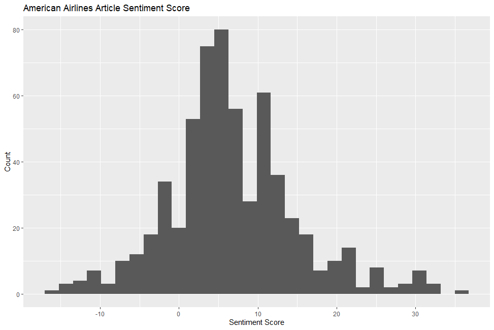

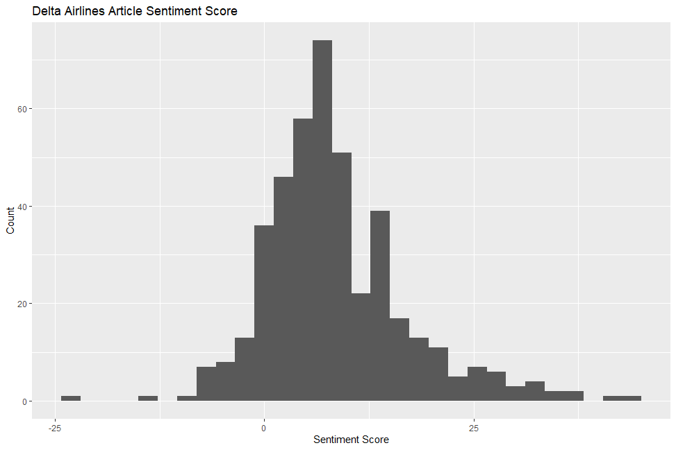

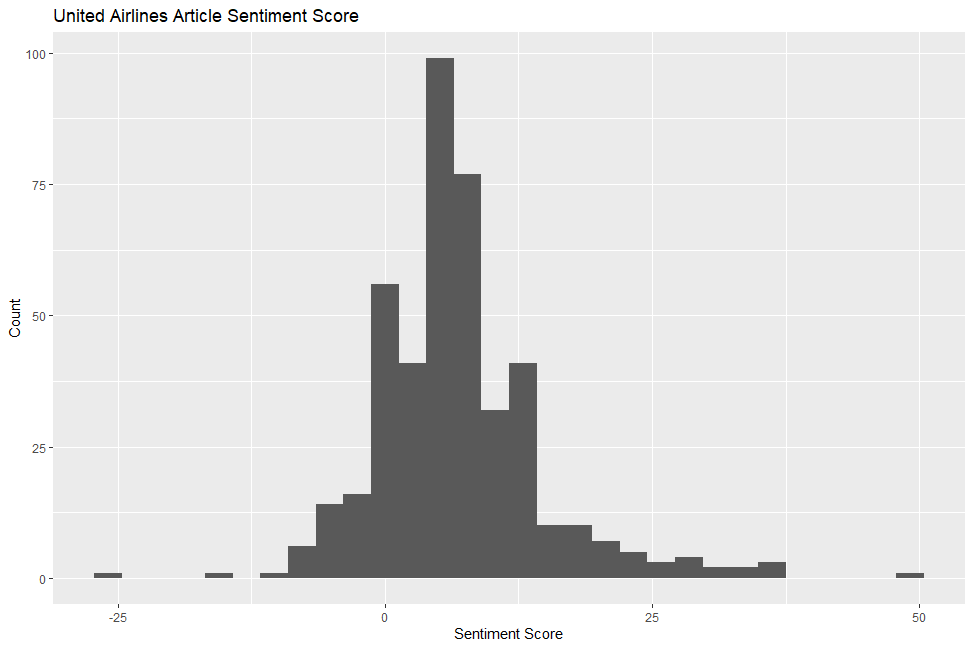

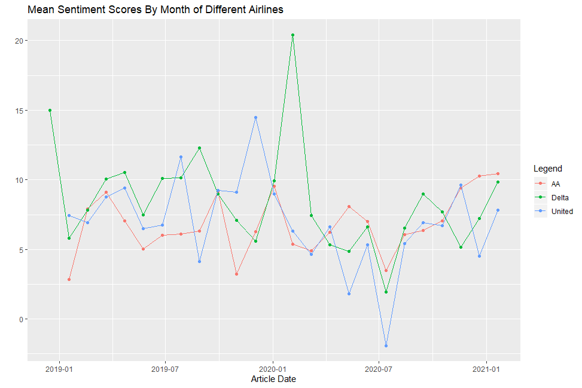

Then the comment sentiment was plotted:

```
# plotting comment sentiment by airline
quickplot(afinn_vector[aa_o], xlab = "Sentiment Score", ylab="Count", main="American Airlines Comment Sentiment Score")
quickplot(afinn_vector[delta_o], xlab = "Sentiment Score", ylab="Count", main="Delta Airlines Comment Sentiment Score")
quickplot(afinn_vector[united_o], xlab = "Sentiment Score", ylab="Count", main="United Airlines Comment Sentiment Score")
```

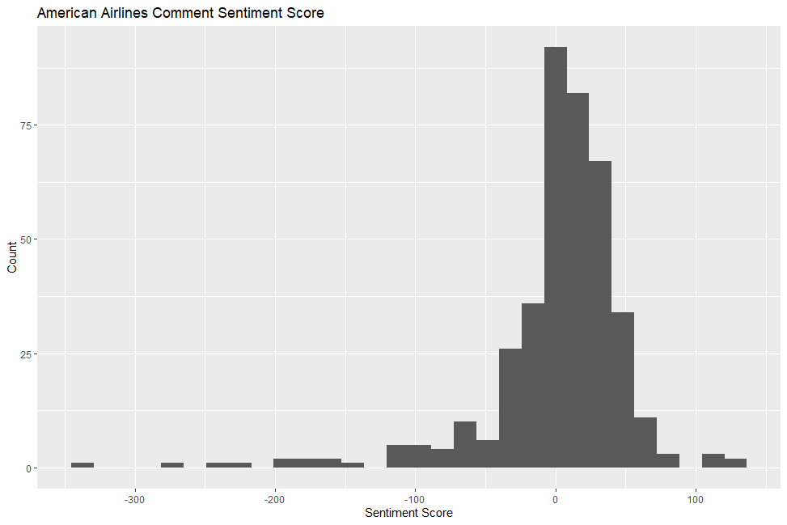

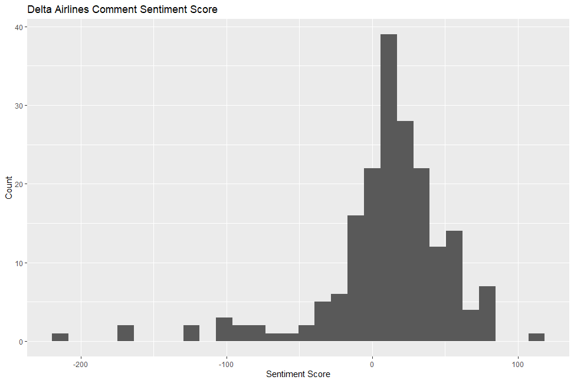

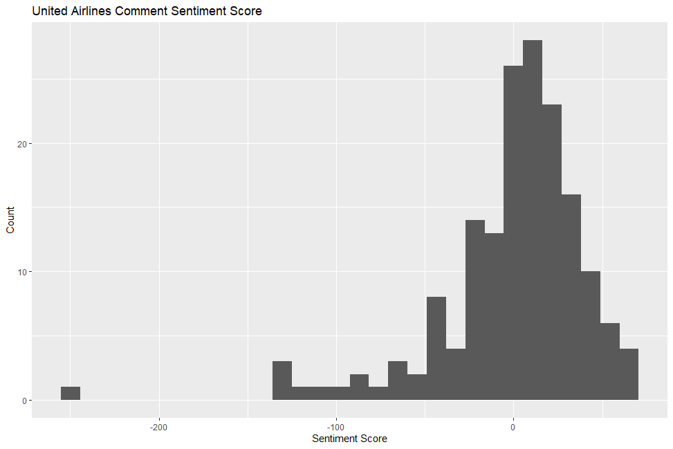

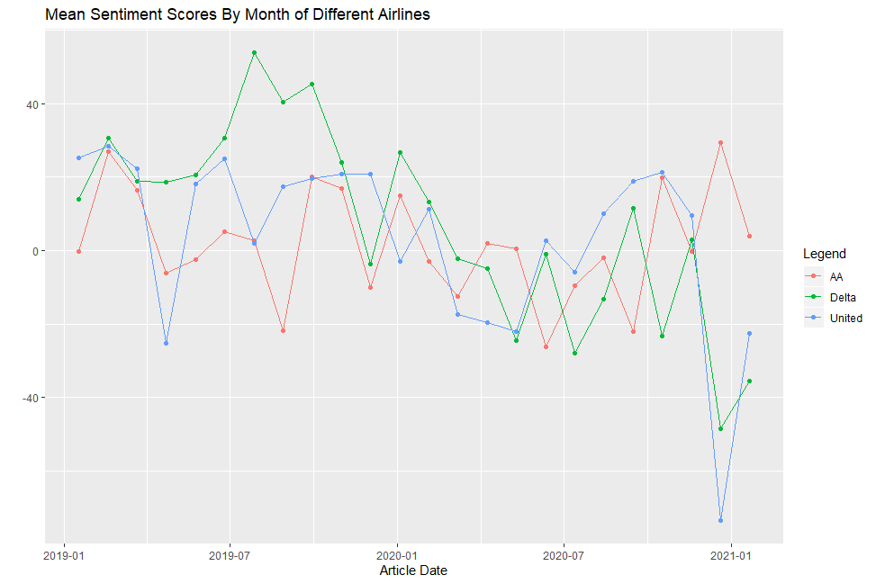

The plots above showed that the sentiment scores between airlines were fairly close but still showed some differences. 

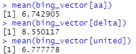


To test if these differences were statistically significant some basic t-tests and Wilcox Mann tests were run to test for significant difference of means. 

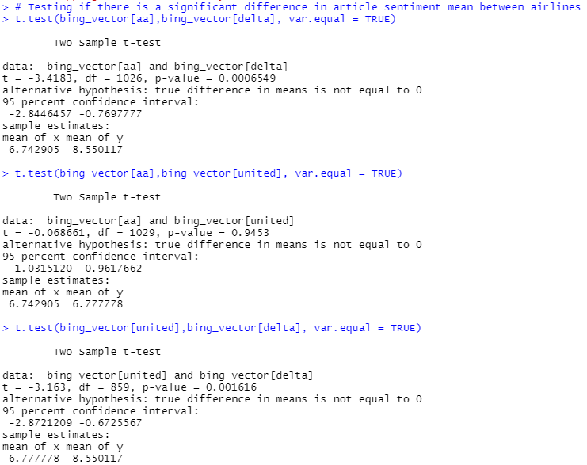

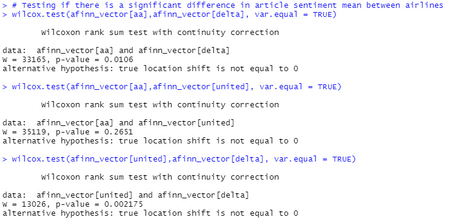

These tests showed that there was not a significant difference between the American Airlines and United Airlines scores for both the article and comments sentiment. However, both of the Delta Airline sentiment scores were significantly higher than the  corresponding American and United scores.

## Future Work

To build off of what this project started there are some future work items that could be explored. This includes refining the sentiment analysis algorithm or technique to get more sophisticated scores. This could be done through the use of machine learning or through the creation of a custom algorithm or lexicon. Another experiment could be to collect socia media data about the different airlines and use that data for sentiment analysis. 

One of major things that was planned to be looked at given the time was whether or not the sentiment scores had any implication on the stock price of the airline. This analysis was started but given the unfamiliarity of time series analysis it was not able to be finished. The primary data seemed to imply that there was some sort of relationship between the two.

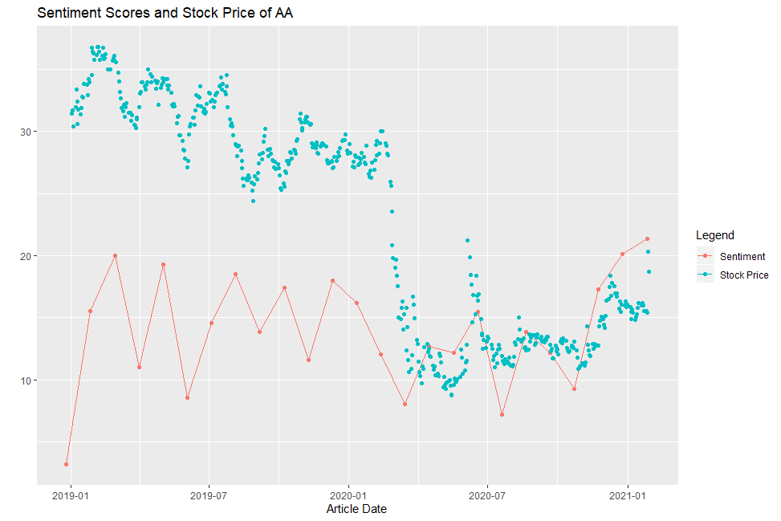

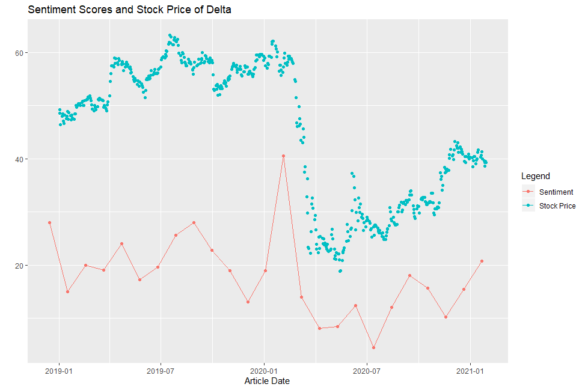

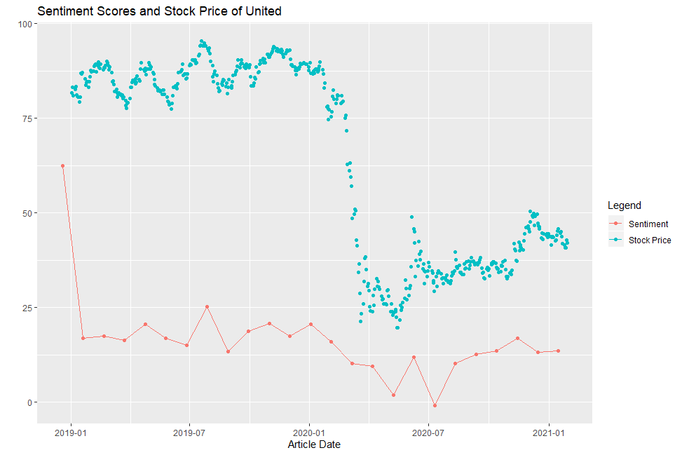

Unfortunately, without further analysis it is hard to say what kind of relationship exists between the two. This relationship can be explored with time series analysis and cross correlation analysis but due to time constraints it was not performed. This analysis will most likely be done in the near future.

## References

- Bing Liu, Minqing Hu and Junsheng Cheng. "Opinion Observer: Analyzing and Comparing Opinions on the Web." Proceedings of the 14th International World Wide Web conference (WWW-2005), May 10-14, 2005, Chiba, Japan.
- Minqing Hu and Bing Liu. "Mining and Summarizing Customer Reviews." Proceedings of the ACM SIGKDD International Conference on Knowledge Discovery and Data Mining (KDD-2004), Aug 22-25, 2004, Seattle, Washington, USA. See: http://www.cs.uic.edu/~liub/FBS/sentiment-analysis.html#lexicon
- Saif Mohammad and Peter Turney. "Emotions Evoked by Common Words and Phrases: Using Mechanical Turk to Create an Emotion Lexicon." In Proceedings of the NAACL-HLT 2010 Workshop on Computational Approaches to Analysis and Generation of Emotion in Text, June 2010, LA, California. See: http://saifmohammad.com/WebPages/lexicons.html
 -Finn Årup Nielsen. "A new ANEW: Evaluation of a word list for sentiment analysis in microblogs", Proceedings of the ESWC2011 Workshop on 'Making Sense of Microposts':Big things come in small packages 718 in CEUR Workshop Proceedings : 93-98. 2011 May. http://arxiv.org/abs/1103.2903. See: http://www2.imm.dtu.dk/pubdb/views/publication_details.php?id=6010
 -Manning, Christopher D., Surdeanu, Mihai, Bauer, John, Finkel, Jenny, Bethard, Steven J., and McClosky, David. 2014. The Stanford CoreNLP Natural Language Processing Toolkit. In Proceedings of 52nd Annual Meeting of the Association for Computational Linguistics: System Demonstrations, pp. 55-60. See: http://nlp.stanford.edu/software/corenlp.shtml
- Richard Socher, Alex Perelygin, Jean Wu, Jason Chuang, Christopher Manning, Andrew Ng and Christopher Potts. "Recursive Deep Models for Semantic Compositionality Over a Sentiment Treebank Conference on Empirical Methods in Natural Language Processing" (EMNLP 2013). See: http://nlp.stanford.edu/sentiment/